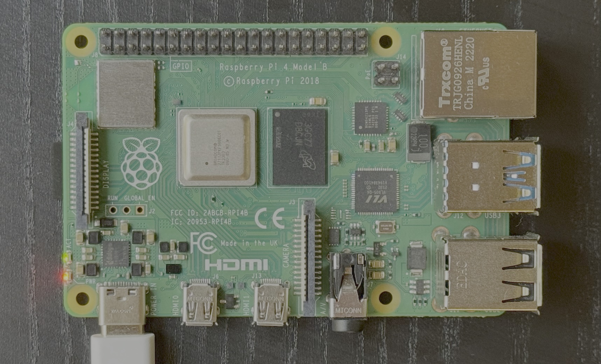
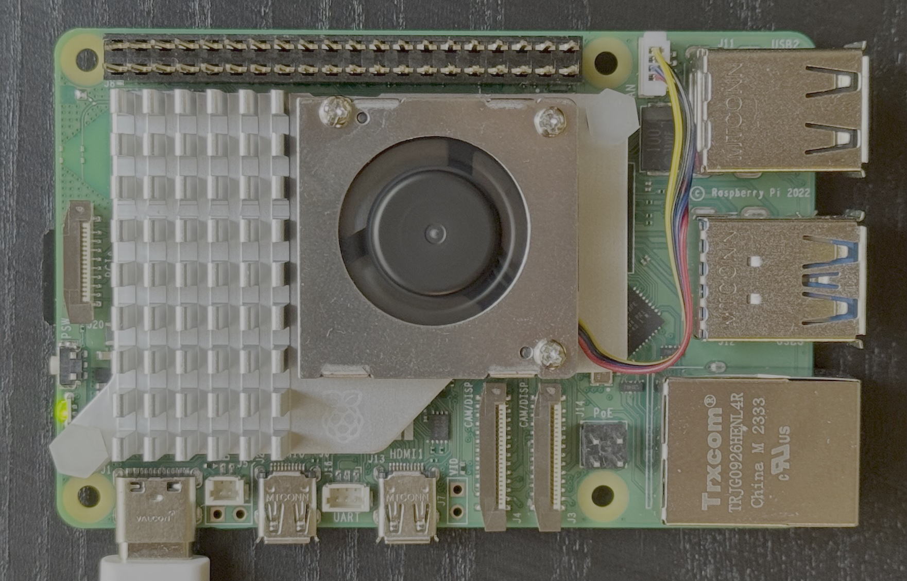

# Embedded Swift Example Projects

This repository is a set of demonstration projects of **Embedded Swift**. Embedded Swift is a compilation and language mode that enables development of baremetal, embedded and standalone software in Swift. To learn more, see:

- [Blog post introducing this repository](https://www.swift.org/blog/embedded-swift-examples/)
- [Swift forums thread about this repository](https://forums.swift.org/t/embedded-swift-example-projects-for-arm-and-risc-v-microcontrollers/71066)
- [Discussions about Embedded Swift on the Swift forums](https://forums.swift.org/t/embedded-swift/67057)
- [Embedded Swift Vision Document](https://github.com/apple/swift-evolution/blob/main/visions/embedded-swift.md)
- [Documentation for Embedded Swift](https://github.com/apple/swift/tree/main/docs/EmbeddedSwift)

## Building the examples

Each example in this repository contains build and deployment instructions, however there are a couple common steps needed for many of the examples included below:

1. Install [`swift`](https://swift.org) using the [instructions here](https://swiftpackageindex.com/apple/swift-embedded-examples/main/documentation/embeddedswift/installembeddedswift).

2. Install [`uv`](https://github.com/astral-sh/uv), "an extremely fast Python package and project manager", using the [instructions here](https://docs.astral.sh/uv/getting-started/installation/).

## Catalog of Examples

| Name | Platform | SDK | Description | Photo |
| ---- | -------- | --- | ----------- | ----- |
| [esp32-led-blink-sdk](./esp32-led-blink-sdk) | ESP32-C6-Bug | ESP-IDF SDK | Blink an LED repeatedly with Swift & the ESP-IDF. |  |
| [esp32-led-strip-sdk](./esp32-led-strip-sdk) | ESP32-C6-DevKitC-1 | ESP-IDF SDK | Control NeoPixel LEDs with Swift & the ESP-IDF. |  |
| [harmony](./harmony) | Raspberry Pi Pico W | Pico SDK | A bluetooth speaker and ferrofluidic music visualizer. Firmware, Electrical, and Mechanical designs fully available. |  |
| [nrfx-blink-sdk](./nrfx-blink-sdk) | nRF52840-DK | Zephyr SDK | Blink an LED repeatedly with Swift & Zephyr. |  |
| [nuttx-riscv-blink](./nuttx-riscv-blink) | QEMU | NuttX | Blink a virualized led in QEMU using the Apache NuttX RTOS | |
| [rpi-4b-blink](./rpi-4b-blink) | Raspberry Pi 4B | None | Blink the Pi's status green LED repeatedly using Swift MMIO. |  |
| [rpi-5-blink](./rpi-5-blink) | Raspberry Pi 5 | None | Blink the Pi's status green LED repeatedly with Swift MMIO. |  |
| [rpi-pico-blink-sdk](./rpi-pico-blink-sdk) | Raspberry Pi Pico, Pico 2 | Pico SDK | Blink an LED repeatedly with Swift & the Pico SDK. |  |
| [rpi-pico-blink](./rpi-pico-blink) | Raspberry Pi Pico | None  | Blink an LED repeatedly. |  |
| [rpi-pico2-neopixel](./rpi-pico2-neopixel) | Raspberry Pi Pico 2 | None | Control Neopixel LEDs using the RP2350 PIO. |  |
| [rpi-picow-blink-sdk](./rpi-picow-blink-sdk) | Raspberry Pi Pico W | Pico SDK | Blink an LED to signal 'SOS' in Morse code repeatedly with Swift & the Pico SDK. |  |
| [stm32-blink](./stm32-blink) | STM32F746G-DISCO | None | Blink an LED repeatedly. |  |
| [stm32-lcd-logo](./stm32-lcd-logo) | STM32F746G-DISCO | None | Animate the Swift Logo on the built-in LCD. |  |
| [stm32-neopixel](./stm32-neopixel) | STM32F746G-DISCO | None | Control NeoPixel LEDs using SPI. |  |
| [stm32-uart-echo](./stm32-uart-echo) | STM32F746G-DISCO | None | Echo user input using UART. | |

Note that the SDK integration examples (Pico SDK, Zephyr SDK, etc.) are not recommendations or endorsement, the same is true for build system choice (Make, CMake, SwiftPM, shell scripts). Embedded Swift aims to be versatile and allowing integration into existing SDKs and build systems, and the example projects show some of the possibilities.

## Community Examples

> [!WARNING]
> Community projects linked here are not officially supported by our team. They may not always be compatible with the latest nightly Swift toolchain builds.

<!-- Please keep this list sorted by "Board" then "Name" -->

| Name | Platform | Description |
| ---- | -------- | ----------- |
| [swift-matter-examples](https://github.com/apple/swift-matter-examples) | ESP32 | An Embedded Swift Matter application running on ESP32-C6. |
| [swift-flipperzero-hello](https://github.com/Sameesunkaria/swift-flipperzero-hello) | Flipper Zero | A demonstration of running Swift apps on the Flipper Zero. |
| [EmbeddedSwift nRF52 Examples](https://github.com/nelcea/EmbeddedSwift-nRF52-Examples) | nRF52840 (Development Kit) | A collection of examples using Embedded Swift on top of nRF Connect SDK (Zephyr). |
| [Swatak](https://github.com/nelcea/EmbeddedSwift-nRF52-Swatak) | nRF52840 (Seeed Studio XIAO) | A reaction time game inspired by BATAK© boards, implemented in Embedded Swift using nRF Connect SDK. |
| [swift-picosystem-example](https://github.com/jerrodputman/swift-picosystem-example) | PicoSystem | An Embedded Swift demo running on the Pimoroni PicoSystem |
| [PlaydateKit](https://github.com/finnvoor/PlaydateKit) | Playdate | A full featured framework for building Playdate games using Embedded Swift. |
| [swift-playdate-examples](https://github.com/apple/swift-playdate-examples) | Playdate | An Embedded Swift game running on Playdate by Panic. |
| [swift-stm32c011-examples](https://github.com/xtremekforever/swift-stm32c011-examples) | STM32 | Examples of running Embedded Swift on the STM32C011, which is a tiny MCU with only 6KB of SRAM and 32KB of flash. |
| [flappy-swift](https://github.com/sliemeobn/flappy-swift) | Web | A WebAssembly game written in Swift in ~100 KB. |
| [swift-for-wasm-examples](https://github.com/apple/swift-for-wasm-examples) | Web | A "Swift Audio Workstation" example built with Swift for WebAssembly running in the browser using Embedded Swift. |

Please note that the presence of community repositories and devices in this list does not constitute a recommendation or endorsement. If there's a project you'd like to see included here, please [submit an issue](https://github.com/apple/swift-embedded-examples/issues/new) with the details.

## Contributing to this repository

This repository contains code that is not continuously developed, instead it's presented "as is" for educational and demonstrational purposes. Making major improvements to existing examples is discouraged, but additions of new examples is welcome.

### Code of Conduct

Like all Swift.org projects, we would like these Embedded Swift example projects to foster a diverse and friendly community. We expect contributors to adhere to the [Swift.org Code of Conduct](https://swift.org/code-of-conduct/).

### Contact information

The current code owners of this repository are Kuba Mracek ([@kubamracek](https://github.com/kubamracek)) and Rauhul Varma ([@rauhul](https://github.com/rauhul)). You can contact them on the Swift forums via the handles [@kubamracek](https://forums.swift.org/u/kubamracek/summary) and [@rauhul](https://forums.swift.org/u/rauhul/summary).

In case of moderation issues, you can also directly contact a member of the [Swift Core Team](https://swift.org/community/#community-structure).
