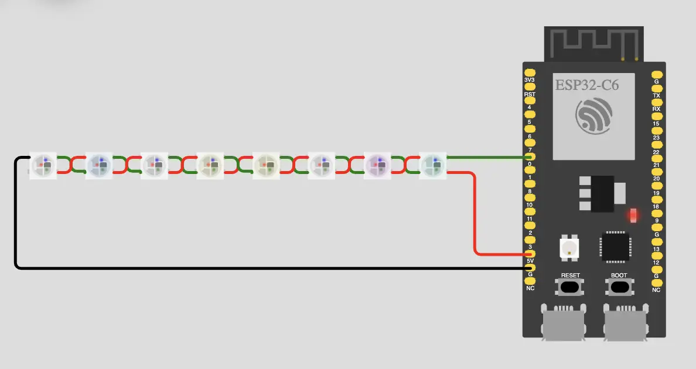

# esp32-led-strip-sdk

This example demonstrates how to integrate with the ESP-IDF SDK via CMake and how to use the existing LED strip library to control WS8212 lights from Swift. This example is specifically made for the RISC-V MCUs from ESP32 (the Xtensa MCUs are not currently supported by Swift).


## Requirements

- Set up the [ESP-IDF](https://docs.espressif.com/projects/esp-idf/en/stable/esp32/) development environment. Follow the steps in the [ESP32-C6 "Get Started" guide](https://docs.espressif.com/projects/esp-idf/en/v5.2/esp32c6/get-started/index.html).
  - Make sure you specifically set up development for the RISC-V ESP32-C6, and not the Xtensa based products.
  
- Before trying to use Swift with the ESP-IDF SDK, make sure your environment works and can build the provided C/C++ sample projects, in particular:
  - Try building and running the "get-started/blink" example from ESP-IDF written in C.

## Building

- Make sure you have a recent nightly Swift toolchain that has Embedded Swift support.
- If needed, run export.sh to get access to the idf.py script from ESP-IDF.
- Specify the nightly toolchain to be used via the `TOOLCHAINS` environment variable and the target board type by using `idf.py set-target`.
``` console
$ cd esp32-led-strip-sdk
$ export TOOLCHAINS=...
$ . <path-to-esp-idf>/export.sh
$ idf.py set-target esp32c6
$ idf.py build
```

## Running

- Connect the ESP32-C6-DevKitC-1 board over a USB cable to your Mac.
- Wire up an external WS8212 LED strip and use GPIO pin 0 as the data pin. You might need to use a level shifter.
- Use `idf.py` to upload the firmware and to run it:

```console
$ idf.py flash
```

- The LED strip should now be animating a sequence of random colors moving in one direction.

## Simulating

The project can be simulated using Wokwi Simulator in [IDE](https://docs.wokwi.com/vscode/getting-started).

- Build the UF2 image recognized by the simulator:

```console
idf.py uf2
```

- Open the directory with the project in the IDE.

- Start the simulator.

Alternatively the project can be launched with pre-built binary in web browser:

[](https://wokwi.com/experimental/viewer?diagram=https://raw.githubusercontent.com/georgik/swift-embedded-examples/feature/wokwi/esp32-led-strip-sdk/diagram.json&firmware=https://github.com/georgik/swift-embedded-examples/releases/download/v0.1/embedded-swift-esp32-c6-led-strip-sdk.uf2.bin
)

[Run on-line in Wokwi Simulator](https://wokwi.com/experimental/viewer?diagram=https://raw.githubusercontent.com/georgik/swift-embedded-examples/feature/wokwi/esp32-led-strip-sdk/diagram.json&firmware=https://github.com/georgik/swift-embedded-examples/releases/download/v0.1/embedded-swift-esp32-c6-led-strip-sdk.uf2.bin
)
