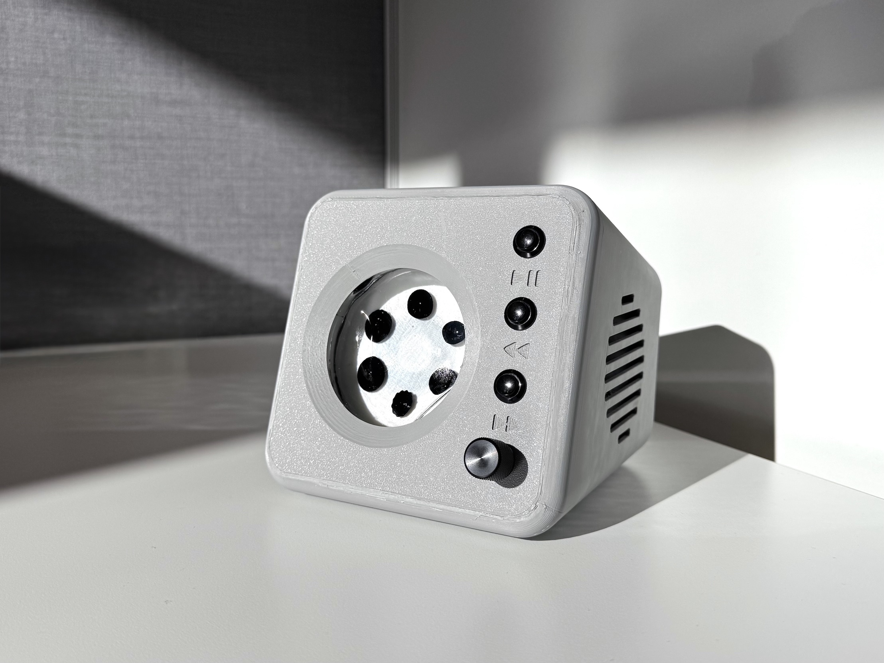

# Harmony

> [!NOTE]
> This README is still under construction.

Harmony is a Bluetooth speaker and Ferrofluidic music visualizer.



## Table of Contents

- [Overview](#overview)
- [Features](#features)
- [Bill of Materials](#bill-of-materials)
- [Compiling the firmware](#compiling-the-firmware)
- [Flashing and running](#flashing-and-running)
- [Monitoring UART](#monitoring-uart)
- [Hardware Setup](#hardware-setup)
- [Software Architecture](#software-architecture)

## Overview

Harmony combines Bluetooth audio streaming with the visual effects of a ferrofluid display reacting to the music's rhythm and bass.

> [!WARNING]
> This project involves power electronics which can be dangerous. Take proper
> safety precautions and consult a qualified professional if unsure.

## Features

- Bluetooth audio streaming (using the SBC codec)
- Ferrofluid visualization synchronized with music
- Volume and playback controls
- Customizable LED lighting effects

## Bill of Materials

A detailed Bill of Materials (BOM) can be found in `BillOfMaterials.md`. This document lists all the necessary components for building Harmony.

## Compiling the firmware

The firmware for Harmony is built using CMake and requires the Raspberry Pi Pico SDK. 

1.  Ensure you have the Pico SDK set up on your system. See the official Raspberry Pi Pico documentation for instructions: [https://www.raspberrypi.com/documentation/pico/getting-started/](https://www.raspberrypi.com/documentation/pico/getting-started/)

2.  Clone the swift-embedded-examples repository (if not already done):
    ```bash
    git clone https://github.com/apple/swift-embedded-examples.git
    cd harmony
    ```

3.  Set the necessary environment variables:
    ```bash
    export PICO_BOARD=pico_w
    export PICO_SDK_PATH='<path-to-your-pico-sdk>' # e.g., ../pico-sdk
    export PICO_EXTRAS_PATH='<path-to-your-pico-extras>' # e.g., ../pico-extras
    export PICO_TOOLCHAIN_PATH='<path-to-the-arm-toolchain>' # e.g., /usr/bin
    ```

4.  Generate the build files using CMake:
    ```bash
    cmake -B build -G Ninja . -DCMAKE_EXPORT_COMPILE_COMMANDS=On
    ```

5.  Build the firmware:
    ```bash
    cmake --build build
    ```

## Flashing and running

To flash the compiled firmware onto the Raspberry Pi Pico, you'll need OpenOCD.

1.  Connect your Pico to your computer using a USB cable and put it into BOOTSEL mode by holding the BOOTSEL button while plugging it in.

2.  Run OpenOCD with the appropriate configuration files:
    ```bash
    openocd -f interface/cmsis-dap.cfg -f target/rp2040.cfg -c "adapter speed 5000" -c "program build/app.elf verify reset exit"
    ```

## Monitoring UART

For debugging and monitoring, you can connect to the Pico's UART using a serial terminal program like `screen`.

1.  Identify the serial port connected to your Pico. You can usually find it using `ls /dev/cu.usbmodem*` on macOS or by checking the Device Manager on Windows.

2.  Connect to the UART using `screen`:
    ```bash
    screen /dev/cu.usbmodem<...> 115200
    ```
    (Replace `<...>` with the correct port identifier)

## Hardware Setup

> [!NOTE]
> This README is still under construction.

## Software Architecture

> [!NOTE]
> This README is still under construction.

The firmware is designed with a modular architecture for efficient audio processing and visualization control.

- **Bluetooth Handlers:** Manage the Bluetooth connection and incoming audio stream using the SBC codec.
- **SBC Ring Buffer:** Stores the decoded SBC audio data for further processing.
- **Audio Decoder:** Decodes the SBC encoded audio stream into PCM (Pulse Code Modulation) format.
- **PCM Ring Buffer:** Stores the decoded PCM audio data.
- **Audio Analyzer:** Analyzes the PCM audio data to extract relevant information like amplitude and frequency. This data is used to control the ferrofluid display.
- **Audio Driver:** Sends the PCM audio data to the DAC (Digital-to-Analog Converter).
- **DAC:** Converts the digital audio signal to an analog signal.
- **Amplifier:** Amplifies the analog audio signal to drive the speaker.
- **Electromagnet Driver:** Controls the electromagnet based on the analyzed audio data, creating the ferrofluid movements.
