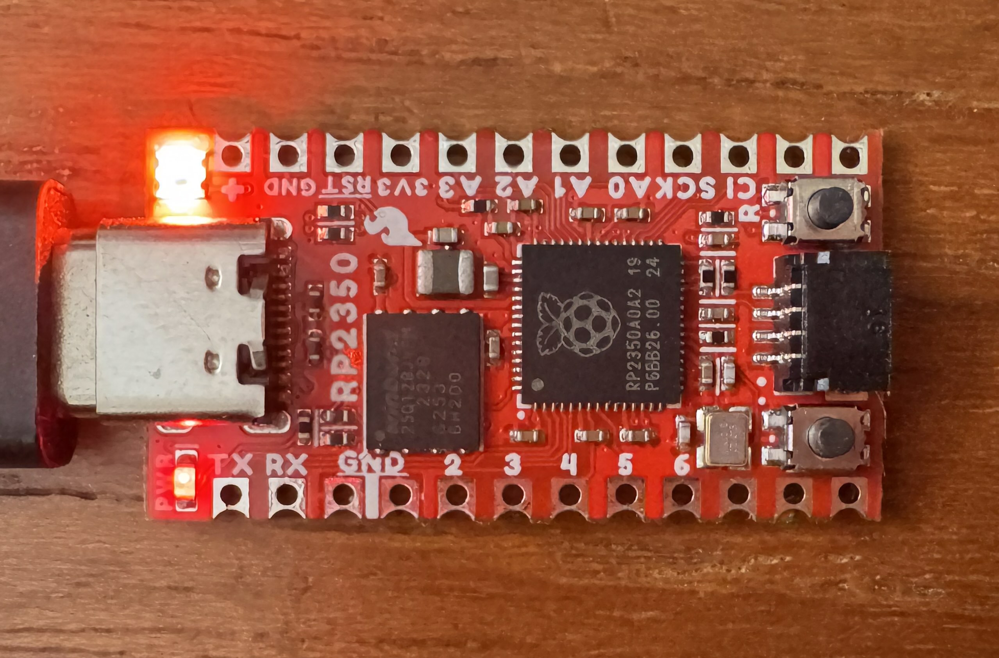

# pico2-neopixel

An example project demonstrating how to drive a Neopixel RGB LED from an RP2350.



## Requirements

- SparkFun Pro Micro - RP2350 board. If you have another RP2350 board this example will require modifications.

## How to build and run this example:

- Connect the Pico2 board via a USB cable to your Mac, and make sure it's in the USB Mass Storage firmware upload mode (either hold the BOOTSEL button while plugging the board, or make sure your Flash memory doesn't contain any valid firmware).
- Make sure you have a recent nightly Swift toolchain that has Embedded Swift support.
- Build and copy the program in the UF2 format to the Mass Storage device to trigger flashing the program into memory (after which the device will reboot and run the firmware):
``` console
$ cd pico2-neopixel
$ TOOLCHAINS='<toolchain-name>' make
$ cp .build/release/Application.uf2 /Volumes/RP2350
```
- The RGB LED should be animating through the color wheel.
