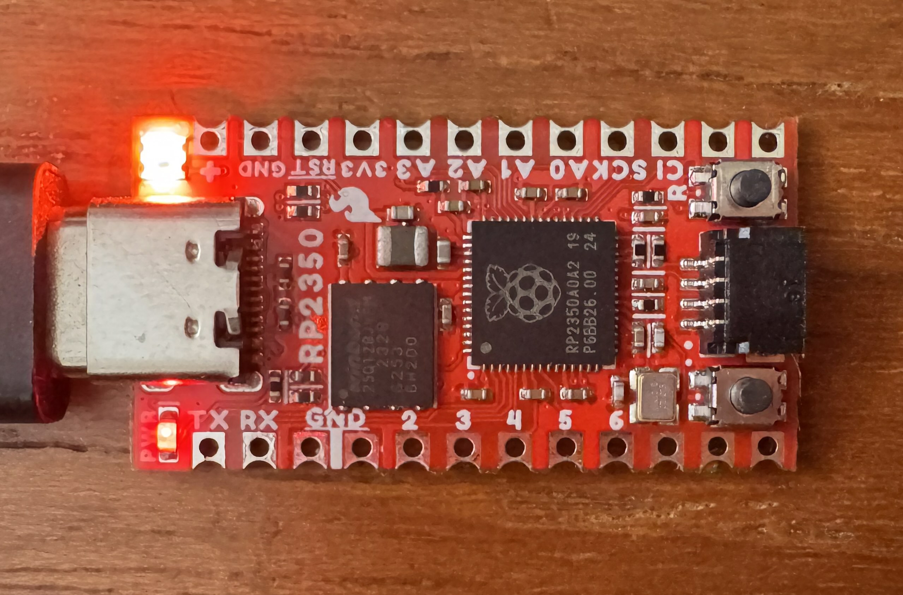

# rpi-pico2-neopixel

An example project demonstrating how to drive a Neopixel RGB LED from an RP2350.



## Requirements

- An RP2350 board, such as the "SparkFun Pro Micro - RP2350".

## Configuring

This example uses the hard coded constant `LED_PIN` in `Application.swift` to select the GPIO pin used to drive the attached Neopixel RGB LED. If you are using the "SparkFun Pro Micro - RP2350" no configuration is necessary, if you are using a different board you will need to adjust this constant to the pin used to drive your LED.

Example diff:

```diff
diff --git a/rpi-pico2-neopixel/Sources/Application/Application.swift b/rpi-pico2-neopixel/Sources/Application/Application.swift
index f6867b5..a2291db 100644
--- a/rpi-pico2-neopixel/Sources/Application/Application.swift
+++ b/rpi-pico2-neopixel/Sources/Application/Application.swift
@@ -11,7 +11,7 @@
 
 import RP2350
 
-let LED_PIN: UInt32 = 25
+let LED_PIN: UInt32 = 18
 
 /// Configures GPIO pin as a front-end to PIO0.
 func configure_output_pin() {
```

## How to build and run this example:

- Connect the Pico2 board via a USB cable to your Mac, and make sure it's in the USB Mass Storage firmware upload mode (either hold the BOOTSEL button while plugging the board, or make sure your Flash memory doesn't contain any valid firmware).
- Make sure you have a recent nightly Swift toolchain that has Embedded Swift support.
- Build and copy the program in the UF2 format to the Mass Storage device to trigger flashing the program into memory (after which the device will reboot and run the firmware):
``` console
$ cd rpi-pico2-neopixel
$ make
$ cp .build/release/Application.uf2 /Volumes/RP2350
```
- The RGB LED should be animating through the color wheel.
