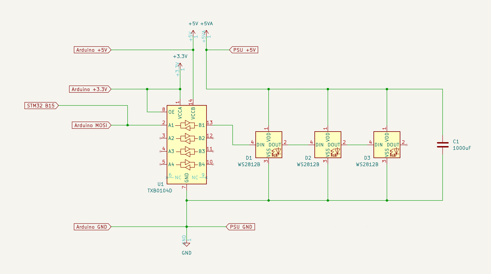

# stm32-neopixel


This demo is designed to run on an STM32 microcontroller and some additional hardware, detailed below:

1. An [STM32F746G Discovery kit](https://www.st.com/en/evaluation-tools/32f746gdiscovery.html)
2. A 3.3V to 5V level shifter such as [Texas Instrument's TXB0104](https://www.ti.com/lit/ds/symlink/txb0104.pdf) which can be found on a breakout board for easier use, such as: [SparkFun Voltage-Level Translator Breakout](https://www.sparkfun.com/products/11771)
3. A NeoPixel WS2812 or compatible LED Strip; such as: [SparkFun LED RGB Strip](https://www.sparkfun.com/products/15205)
4. A breadboard, such as: [SparkFun Translucent Breadboard](https://www.sparkfun.com/products/9567)
5. A 5V power supply

Connect the components as shown in the schematic below:



We recommend including a capacitor across the LED strip power supply.

## How to build and run this example:

- Connect the STM32F746G-DISCO board via the ST-LINK USB port to your Mac.
- Make sure you have a recent nightly Swift toolchain that has Embedded Swift support.
- Install the `stlink` (https://github.com/stlink-org/stlink) command line tools, e.g. via `brew install stlink`.
- Build and upload the program to flash memory of the STM:
```console
$ cd stm32-neopixel
$ make
$ st-flash --reset write .build/release/Application.bin 0x08000000
```
- The LED strip should light up and slowly animate a color gradient.
